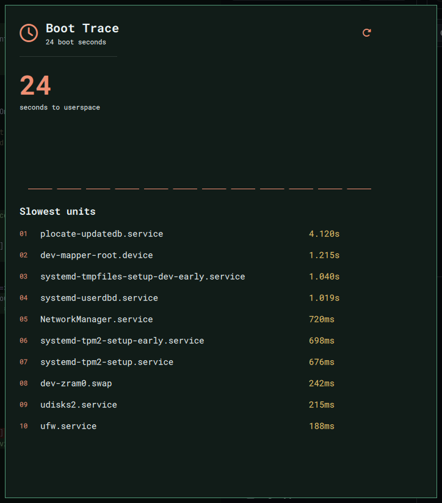

# Boot Trace

[](https://github.com/AdamMusa/omarchy-ui)
[](LICENSE)

**Turn the last boot into a readable critical-path timeline.**

Boot Trace translates systemd-analyze output into a compact timeline of the services that consumed startup time, with bounded history and no service controls.



## Why this is distinct

Systemd managers control units and failure widgets report broken services. Boot Trace focuses exclusively on boot latency and its critical timing path.

The concept was checked against the complete Omarchy Plugin Marketplace catalog before development.

## Install

```bash
omarchy plugin add https://github.com/AdamMusa/omarchy-boot-trace.git --enable
```

The repository is self-contained. Omarchy UI asks Zui 0.0.10 to tree-shake the QML renderer at
bundle time, so users do not need Ruby or framework gems on the destination.

Review third-party plugin code before enabling it. Omarchy community plugins run with your user account.

## Use

Add **Boot Trace** to the Omarchy bar and click its widget to open the panel. The plugin is keyboard-friendly, theme-aware, and designed for a 660 × 760 panel.

## Data, permissions, and safety

- Local state: `~/.local/state/omarchy-boot-trace/state.json`
- State, command output, item counts, history, and rendered strings are bounded.
- State writes use an owner-only temporary file and atomic rename.
- System probes are read-only and invoke fixed argument arrays without a shell.

- No telemetry, analytics, remote account, package installation, or privileged command is used.
- The plugin never overwrites Omarchy, Hyprland, or application configuration.

External runtime tools are limited to standard commands already present on Omarchy when a feature needs them. Missing optional commands degrade to an explicit unavailable state. The exact commands are visible in [`lib/backend.rb`](lib/backend.rb).

## Remove

```bash
omarchy plugin remove izeesoft.boot-trace
```

Removal leaves the local state file in place so reinstalling preserves history. To erase it too:

```bash
rm -r ~/.local/state/omarchy-boot-trace
```

## Marketplace metadata

- Plugin ID: `izeesoft.boot-trace`
- Category: System
- Tags: system, bar, quickshell
- Kinds: service, bar widget, panel
- Target: Omarchy Quattro on x86-64 Linux

## Development

The user interface is written entirely in Ruby with [Omarchy UI](https://github.com/AdamMusa/omarchy-ui).
The repository contains the thin Omarchy QML bridge, attested mruby runtime, and the exact
tree-shaken QML source snapshot used to compile the native module. `zui-tree-shake.json`
records the selected component set and byte reduction.

```bash
sha256sum --check omarchy-ui-runtime.sha256
scripts/rebuild-qml-bundle.sh
ruby test/backend_test.rb
omarchy plugin validate .
```

QML reproduction and runtime provenance are documented in
[`REPRODUCIBLE_BUILD.md`](REPRODUCIBLE_BUILD.md) and
[`RUNTIME_PROVENANCE.md`](RUNTIME_PROVENANCE.md).

## License

MIT.
